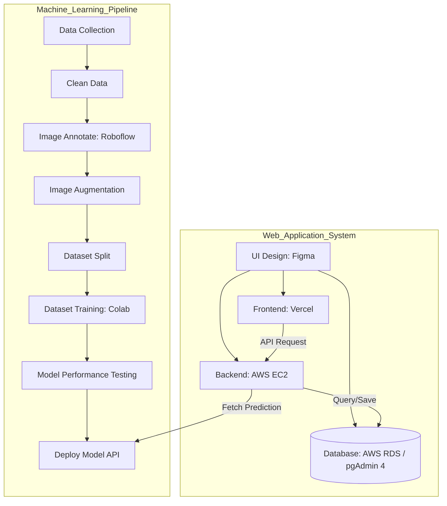

# 🍛 KaKaloly - Thai Food Calorie Tracking & Analysis Web App

## 1. Overview (ภาพรวมของโปรเจค)
**KaKaloly** เป็นเว็บแอปพลิเคชันสำหรับบันทึก ติดตาม และวิเคราะห์ปริมาณแคลอรี่ที่ได้รับจากอาหาร โดยใช้เทคโนโลยีการจำแนกภาพอาหารไทยด้วย Machine Learning (Image Classification)

โปรเจคนี้ถูกพัฒนาขึ้นเพื่อแก้ปัญหาพฤติกรรมการบริโภคในยุคเร่งด่วน ที่ผู้คนมักมองข้ามสารอาหารและขาดการบันทึกข้อมูลโภชนาการ โดยแอปพลิเคชันสามารถ:
- สแกนรูปภาพเพื่อจำแนกเมนูอาหารไทยได้ 10 ชนิด (เช่น ต้มจืด, ผัดผงกะหรี่, ไก่ย่าง, ทอดมัน, ไข่พะโล้, กุ้งเผา, ยำวุ้นเส้น, ผัดคะน้า, ข้าวคลุกกะปิ, ก๋วยจั๊บ)
- คำนวณและแสดงปริมาณแคลอรี่ที่เหมาะสมสำหรับผู้ใช้งานแต่ละคน
- แจ้งเตือนเมื่อผู้ใช้งานรับประทานอาหารที่มีแคลอรี่สูงเกินขีดจำกัดที่ส่งผลเสียต่อสุขภาพ

## 2. Objectives (วัตถุประสงค์)
- เพื่อพัฒนาเว็บแอปพลิเคชันสำหรับบันทึกและวิเคราะห์แคลอรี่จากรูปภาพอาหารไทยด้วย Machine Learning
- เพื่อประเมินคุณภาพของเว็บแอปพลิเคชันโดยผู้เชี่ยวชาญเฉพาะทาง
- เพื่อประเมินความพึงพอใจของกลุ่มผู้ใช้งานจริงที่มีต่อแอปพลิเคชัน

## 3. Project Architecture & Flow (แผนภาพการทำงาน)
ภาพรวมการทำงานของระบบถูกแบ่งออกเป็น 2 ส่วนหลัก คือ ส่วนของการสร้างโมเดล (Machine Learning) และส่วนของการพัฒนาเว็บไซต์ (Web Application)

**🛠 Tech Stack (เครื่องมือที่ใช้)**

Frontend: Vercel, HTML/CSS/JS (Figma for UI)

Backend: AWS EC2, Postman (API Testing)

Database: AWS RDS, pgAdmin 4 (PostgreSQL)

Machine Learning: Google Colab, Roboflow, AWS

## 4. How to Use (การติดตั้งและใช้งาน)
Note: เนื่องจากโปรเจคนี้มีการแบ่งส่วน Frontend และ Backend ควรเปิด Terminal 2 หน้าต่างเพื่อรันระบบพร้อมกัน

Prerequisites
Node.js

PostgreSQL (หรือการเชื่อมต่อ AWS RDS ที่ใช้งานได้)

ขั้นตอนการรันโปรเจค (Local Development)
Clone repository:

Bash
git clone [https://github.com/Rinrada19/kakaloly.git](https://github.com/Rinrada19/kakaloly)
cd kakaloly
ตั้งค่า Backend:

Bash
cd backend
npm install
# สร้างไฟล์ .env ในโฟลเดอร์ backend และระบุค่า DB_URL และ API_KEY
npm run dev
ตั้งค่า Frontend:

Bash
cd ../frontend
npm install
npm run dev
การใช้งาน:
เปิด Browser ไปที่ http://localhost:3000
